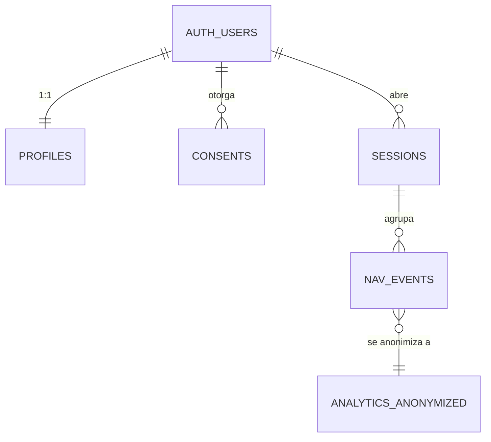

# Diseño del modelo de datos — Capa privada (Supabase)

**Proyecto:** IME Conecta · capa privada de trazas de navegación
**Estado:** Diseño para implementación. Sujeto a validación legal (ver Informe Operativo-Legal y Borrador de Aviso de Privacidad).
**Versión:** 0.1 · 21 de junio de 2026

> Principio rector: **cumplimiento por diseño**. Consentimiento granular, minimización, separación entre identidad y trazas, y anonimización irreversible para el laboratorio.

---

## 1. Entidades

| Tabla | Propósito |
|---|---|
| `profiles` | Datos mínimos de la persona registrada (1:1 con `auth.users` de Supabase). |
| `consents` | Registro auditable de consentimientos otorgados/revocados. |
| `sessions` | Sesiones de navegación (agrupan eventos). |
| `nav_events` | Trazas de navegación: sección/activo digital, tiempo, tipo de evento. |
| `analytics_anonymized` | Vista/tabla derivada, **anonimizada irreversible**, para el laboratorio. |

Supabase Auth (`auth.users`) gestiona credenciales; no replicamos contraseñas.

---

## 2. Esquema SQL (PostgreSQL)

```sql
-- Perfil mínimo, ligado a auth.users
create table public.profiles (
  id          uuid primary key references auth.users(id) on delete cascade,
  display_name text,
  created_at  timestamptz not null default now()
);

-- Consentimientos (auditable, versionado)
create table public.consents (
  id            uuid primary key default gen_random_uuid(),
  user_id       uuid not null references auth.users(id) on delete cascade,
  scope         text not null check (scope in ('account','tracking')),
  granted       boolean not null,
  policy_version text not null,           -- versión del aviso aceptado
  channel       text not null default 'web',
  created_at    timestamptz not null default now()
);

-- Sesiones de navegación
create table public.sessions (
  id          uuid primary key default gen_random_uuid(),
  user_id     uuid not null references auth.users(id) on delete cascade,
  started_at  timestamptz not null default now(),
  ended_at    timestamptz
);

-- Trazas: activo digital + tiempo + evento
create table public.nav_events (
  id           bigint generated always as identity primary key,
  session_id   uuid not null references public.sessions(id) on delete cascade,
  user_id      uuid not null references auth.users(id) on delete cascade,
  asset        text not null,            -- sección / activo digital (ej. 'gobernanza')
  event_type   text not null check (event_type in ('view','dwell','scroll','click','download','audio')),
  dwell_ms     integer,                  -- tiempo de permanencia (para 'dwell')
  value        jsonb,                    -- payload adicional minimizado
  occurred_at  timestamptz not null default now()
);

create index on public.nav_events (user_id, occurred_at);
create index on public.nav_events (asset);
```

Notas de minimización:
- **No** se almacena IP ni user-agent crudo en `nav_events`. Si se requiere dispositivo, guardar categoría (ej. `móvil`/`escritorio`), no la cadena completa.
- `value` (jsonb) debe limitarse a datos no identificatorios.

---

## 3. Seguridad a nivel de fila (RLS)

Cada persona solo ve y escribe lo suyo. La captura de trazas se permite **solo si existe consentimiento `tracking` vigente**.

```sql
alter table public.profiles   enable row level security;
alter table public.consents   enable row level security;
alter table public.sessions   enable row level security;
alter table public.nav_events enable row level security;

-- Perfil propio
create policy "perfil propio" on public.profiles
  for all using (auth.uid() = id) with check (auth.uid() = id);

-- Consentimientos propios
create policy "consentimientos propios" on public.consents
  for all using (auth.uid() = user_id) with check (auth.uid() = user_id);

-- Sesiones propias
create policy "sesiones propias" on public.sessions
  for all using (auth.uid() = user_id) with check (auth.uid() = user_id);

-- Función: ¿tiene consentimiento de tracking vigente?
create or replace function public.has_tracking_consent(uid uuid)
returns boolean language sql stable as $$
  select coalesce((
    select granted from public.consents
    where user_id = uid and scope = 'tracking'
    order by created_at desc limit 1
  ), false);
$$;

-- Lectura de trazas propias
create policy "trazas propias - select" on public.nav_events
  for select using (auth.uid() = user_id);

-- Inserción de trazas SOLO con consentimiento vigente
create policy "trazas propias - insert con consentimiento" on public.nav_events
  for insert with check (auth.uid() = user_id and public.has_tracking_consent(auth.uid()));
```

---

## 4. Flujos clave

### 4.1 Registro + consentimiento
1. Persona se registra (Supabase Auth) → se crea fila en `profiles`.
2. Se inserta consentimiento `scope='account', granted=true` (obligatorio) con `policy_version`.
3. Casilla opcional de trazas → consentimiento `scope='tracking'` (granted true/false).

### 4.2 Captura de trazas
- El cliente abre una `session` al iniciar; envía `nav_events` (view/dwell por sección).
- RLS bloquea inserciones si no hay consentimiento `tracking` vigente.

### 4.3 Derechos ARSOPB (panel "Gestiona mis datos")
- **Acceso/Portabilidad:** `select` de `profiles + consents + sessions + nav_events` → exportar JSON/CSV.
- **Supresión:** `delete from auth.users` (cascada borra todo lo asociado).
- **Revocación de tracking:** insertar consentimiento `scope='tracking', granted=false` → la función RLS deja de permitir nuevas trazas; aplicar política de borrado/anonimización de las existentes.
- Plazo de respuesta: ≤ 30 días.

### 4.4 Anonimización para el laboratorio
Job periódico que vuelca a `analytics_anonymized` **sin** `user_id` ni identificadores, agregando por `asset` y franjas de tiempo (irreversible). Esa tabla sí puede usarse libremente para modelado (deja de ser dato personal).

```sql
create table public.analytics_anonymized (
  asset        text not null,
  bucket_date  date not null,           -- agregación diaria (sin timestamp exacto)
  views        integer not null default 0,
  dwell_ms_avg integer,
  primary key (asset, bucket_date)
);
```

---

## 5. Mapeo con los skins (Constelar / Espectro)
Los mockups consumirán **`analytics_anonymized`** (datos agregados, sin riesgo legal) para visualizar/audicionar patrones. Cada `asset` = una estrella; `views`/`dwell_ms_avg` = tamaño/tono.

---

## 6. Pendientes a validar mañana
1. Confirmar acceso a la cuenta Supabase y crear el proyecto/migraciones.
2. Ajustar campos según decisión legal (retención, menores, qué eventos capturar).
3. Implementar cliente de captura (con guardas de consentimiento) y el panel de derechos.
4. Programar el job de anonimización.


